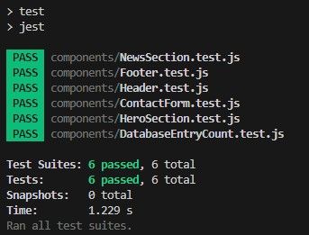

# e-learning
This is an application that is mainly for the third project (Labb 3) in the course "Webbutveckling med React" at IT-högskolan.  
This is a Next.js app that will be a foundation for an e-learning platform. Perhaps to use for a real life purpose. Let's see.  
The course video materials are available on YouTube and are embedded to each respective course.  

# Demo
Live link to a deployed version: <a href="https://react-elarning-app.vercel.app/" target="_blank">https://react-elarning-app.vercel.app/</a>

# Setting up
Started by setting up the GitHub repo:
https://github.com/RobertAhlin/react-elearning-app  
Opened with GitHub Desktop  
Clonded and opened with VS Code

## Created a new Next.js project
In terminal ran the following command: `npx create-next-app@latest . --use-npm --example "https://github.com/vercel/next-learn/tree/main/basics/learn-starter"`  
Since `npx create-next-app .` made something strange to the app.  
Start the development server: `npm run dev`  

# Developement progress
* First I tried using an API to YouTube an actually got that working. I soon discovered that my "unlisted" videos was not able to to be fetched. So instead I implemented to show a random quote to will encurage for happiness.
* Instead I made a database.json file with urls to all the videos.  
* I made four pages. One for each course and one with a contact form. (The contact from is not yet functional it's out of the scope for the Lab 3, It's implemented for the component function.)
* To meet the API critera; I instead fetch a quote that add happiness and incourage to studying.
* Made some simple CSS styling.  
* At this stage I had been struggeling with all kinds of things that didn't work as expected. So I ended up creating a new repo and created the app with another command described in the section above.  
* After getting everything to work in the new repo I created tests.
* Lastly I deployed to Vercel. 

# Components
There are in total 13 components:
1. **Card**: Displays a card containing embedded YouTube video.
2. **ContactForm**: Renders a form for users to input their contact information and message.
3. **Footer**: Contains a section at the bottom of the page, often used for displaying quotes or other information.
4. **Header**: Typically located at the top of the page, containing navigation links and other header elements.
5. **HeroSection**: Represents the hero section of the webpage, usually containing a large image or video with accompanying text.
6. **Navbar**: Renders a navigation bar with links to different pages of the website.
7. **NewsSection**: Displays the latest news items fetched from a JSON file, usually containing a title, date, and text.
8. **QuoteList**: Fetches and displays a list of quotes from an external API, often used in the footer or other sections.
9. **Kontakt**: Represents the contact page of the website, including a header, contact form, and footer.
10. **Home**: The main landing page of the website, including a header, hero section, news section, and footer.
11. **Page1**: Represents a specific page of the website, in this case, "Introduktion till säkerhetsskydd," displaying cards with relevant content.
12. **Page2**: Represents another specific page of the website, focusing on "Personalsäkerhet," displaying cards with relevant content.
13. **Page3**: Represents yet another specific page of the website, centered around "Säkerhetsskyddsplanering," displaying cards with relevant content.

# Tests
### 1. NewsSection test:
- **Description**: Verifies that the NewsSection component renders no more than 3 news articles.
- **Implementation**: Renders the NewsSection component and checks that there are no more than 3 news articles displayed.

### 2. HeroSection test:
- **Description**: Ensures that the HeroSection component renders without crashing.
- **Implementation**: Renders the HeroSection component with provided props and verifies that it renders successfully.

### 3. Header test:
- **Description**: Validates that the Header component renders without crashing.
- **Implementation**: Renders the Header component and checks that it renders successfully without throwing any errors.

### 4. Footer test:
- **Description**: Validates that the Footer component renders without crashing.
- **Implementation**: Renders the Footer component and checks that it renders successfully without throwing any errors.

### 5. DatabaseEntryCount test:
- **Description**: Checks the number of entries for each category in the database.
- **Implementation**: Reads the JSON database file and verifies that each category has the correct number of entries.

### 6. ContactForm test:
- **Description**: Verifies that the ContactForm component renders without errors.
- **Implementation**: Renders the ContactForm component and ensures that it renders successfully without throwing any errors.

All test pass:  

# Deploy
Deployed to Vercel using this guide: <a href="https://nextjs.org/learn-pages-router/basics/deploying-nextjs-app" target="_blank">Deploying Your Next.js App</a>

# Checking Assessment criteria
## For G

**1. Create a project on GitHub and link to the project when submitting.**  
Yes. Link to GitHub: <a href="https://github.com/RobertAhlin/react-elearning-app" target="_blank">https://github.com/RobertAhlin/react-elearning-app</a>

**2. Set up a Next.js project.**  
Yes. In terminal ran the following command: `npx create-next-app@latest . --use-npm --example "https://github.com/vercel/next-learn/tree/main/basics/learn-starter"`  

**3. At least 8 functional components.**  
Yes. Using 13 to meet the VG grade criteria.
1. Card
2. ContactForm
3. Footer
4. Header
5. HeroSection
6. Navbar
7. NewsSection
8. QuoteList
9. Kontakt
10. Home
11. Page1
12. Page2
13. Page3  

More information about each component can be found in the Components section above.

**4. Fetch data from an external site. Optional to use REST API or GraphQL.**  
Yes. This React component, QuoteList, fetches quotes from an external API using the Axios library. It sends a GET request to https://api.api-ninjas.com/v1/quotes with a query parameter category=happiness and includes an API key in the request headers. Upon receiving the response, it updates the state with the retrieved quotes and renders them on the webpage. Each quote is displayed within a blockquote element along with its author.

**5. Create at least 3 statically generated pages with getStaticProps().**  
(It's okay if it's 1 page that generates at least 3 static pages).  
Yes. 
- Data Fetching: Each page (Page1.js, Page2.js, Page3.js) fetches data from the database.json file located in the db folder. The data contains information about different categories, such as "Introduktion till säkerhetsskydd", "Personalsäkerhet", and "Säkerhetsskyddsplanering".  
- Statically Generated Pages: Each page exports an async function named `getStaticProps()`. This function is used by Next.js to pre-render the page at build time. Inside `getStaticProps()`, data is fetched from database.json and passed as props to the page component.  
- Dynamic Content: The fetched data is passed as props (urls) to the respective page components (Page1, Page2, Page3). Each page then dynamically renders cards based on the data received.

**6. Write at least 3 tests that pass when running "yarn test" / "npm test".**  
Yes, there are six test to meet the VG grade criteria
1. NewsSection test
2. HeroSection test
3. Header test
4. Footer test
5. DatabaseEntryCount test
6. ContactForm test

Read more about each test in the Tests section above.

**7. Deploy your React application to vercel.com.**  
Yes. It is deployded to Vercel: <a href="https://react-elarning-app.vercel.app/" target="_blank">https://react-elarning-app.vercel.app/</a>

## For VG (Higher Grade):

**8. At least 12 components.**  
Yes, see Components section above.

**9. Write at least 5 tests that pass when running "yarn test" / "npm test".**  
Yes. See the Tests section above.  

**10. Uniformly formatted code.**
Yes. I follow best pracicies about
- Indentation: Ensure consistent indentation throughout the project.
- Naming Conventions: Follow a consistent naming convention for variables, functions, components, and other identifiers.
- Spacing: Maintain consistent spacing around operators, commas, braces, and other syntactic elements.
- Code Structure: Organize the code in a clear and consistent manner. Use consistent patterns for component structure, file organization, and module imports.
- Linting and Formatting Tools: Using ESLint and Prettier extension.