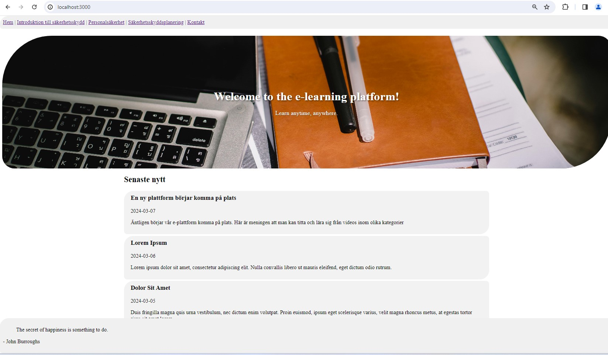

# e-learning
This is an application that is mainly for the third project (Labb 3) in the course "Webbutveckling med React" at IT-högskolan.  
This is a Next.js app that will be a foundation for an e-learning platform. Perhaps to use for a real life purpose. Let's see.  
The course video materials are available on YouTube and are embedded to each respective course.  

# Setting up
Started by setting up the GitHub repo:
https://github.com/RobertAhlin/react-elearning-app  
Opened with GitHub Desktop  
Clonded and opened with VS Code

## Created a new Next.js project
In terminal ran the following command: `npx create-next-app@latest . --use-npm --example "https://github.com/vercel/next-learn/tree/main/basics/learn-starter"`  
Since `npx create-next-app .` made something strange to the app.  
Start the development server: `npm run dev`  

# Developement progress
* First I tried using an API to YouTube an actually got that working. I soon discovered that my "unlisted" videos was not able to to be fetched. So instead I implemented to show a random quote to will encurage for happiness.
* Instead I made a database.json file with urls to all the videos.  
* I made four pages. One for each course and one with a contact form. (The contact from is not yet functional it's out of the scope for the Lab 3, It's implemented for the component function.)
* To meet the API critera; I instead fetch a quote that add happiness and incourage to studying.
* Made some simple CSS styling.  
* At this stage I had been struggeling with all kinds of things that didn't work as expected. So I ended up creating a new repo and created the app with another command described in the section above.  
* After getting everything to work in the new repo I created tests.

# Components
There are in total 13 components:
1. **Card**: Displays a card containing embedded YouTube video.
2. **ContactForm**: Renders a form for users to input their contact information and message.
3. **Footer**: Contains a section at the bottom of the page, often used for displaying quotes or other information.
4. **Header**: Typically located at the top of the page, containing navigation links and other header elements.
5. **HeroSection**: Represents the hero section of the webpage, usually containing a large image or video with accompanying text.
6. **Navbar**: Renders a navigation bar with links to different pages of the website.
7. **NewsSection**: Displays the latest news items fetched from a JSON file, usually containing a title, date, and text.
8. **QuoteList**: Fetches and displays a list of quotes from an external API, often used in the footer or other sections.
9. **Kontakt**: Represents the contact page of the website, including a header, contact form, and footer.
10. **Home**: The main landing page of the website, including a header, hero section, news section, and footer.
11. **Page1**: Represents a specific page of the website, in this case, "Introduktion till säkerhetsskydd," displaying cards with relevant content.
12. **Page2**: Represents another specific page of the website, focusing on "Personalsäkerhet," displaying cards with relevant content.
13. **Page3**: Represents yet another specific page of the website, centered around "Säkerhetsskyddsplanering," displaying cards with relevant content.

# Tests
### 1. NewsSection test:
- **Description**: Verifies that the NewsSection component renders no more than 3 news articles.
- **Implementation**: Renders the NewsSection component and checks that there are no more than 3 news articles displayed.

### 2. HeroSection test:
- **Description**: Ensures that the HeroSection component renders without crashing.
- **Implementation**: Renders the HeroSection component with provided props and verifies that it renders successfully.

### 3. Header test:
- **Description**: Validates that the Header component renders without crashing.
- **Implementation**: Renders the Header component and checks that it renders successfully without throwing any errors.

### 4. Footer test:
- **Description**: Validates that the Footer component renders without crashing.
- **Implementation**: Renders the Footer component and checks that it renders successfully without throwing any errors.

### 5. DatabaseEntryCount test:
- **Description**: Checks the number of entries for each category in the database.
- **Implementation**: Reads the JSON database file and verifies that each category has the correct number of entries.

### 6. ContactForm test:
- **Description**: Verifies that the ContactForm component renders without errors.
- **Implementation**: Renders the ContactForm component and ensures that it renders successfully without throwing any errors.

All test pass:  

## Deploy on Vercel

The easiest way to deploy your Next.js app is to use the [Vercel Platform](https://vercel.com/new?utm_medium=default-template&filter=next.js&utm_source=create-next-app&utm_campaign=create-next-app-readme) from the creators of Next.js.

Check out our [Next.js deployment documentation](https://nextjs.org/docs/deployment) for more details.